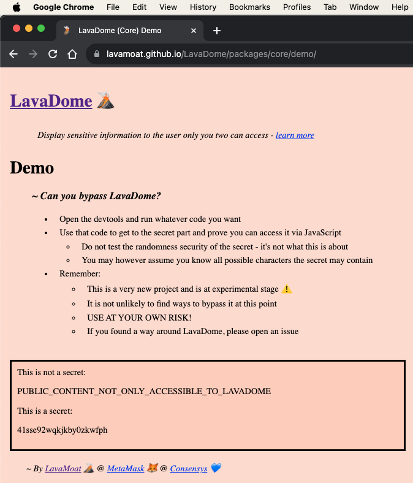

<div align="center">
    <h1> LavaDome 🌋️ </h1>
    <i> ~ A new <a href="https://github.com/lavamoat">LavaMoat</a> tool for <b>DOM</b> nodes secured <b>E</b>ncapsulation ~ </i>
    <br><br>
</div> 

> ⚠️ EXPERIMENTAL [WIP] - USE AT YOUR OWN RISK ([learn more](#Disclaimer)) 

## [**Demo**](https://lavamoat.github.io/LavaDome/packages/core/demo/)

_Take a crack at `LavaDome` - visit the [demo app](https://lavamoat.github.io/LavaDome/packages/core/demo/), open the console, and do whatever in your power to steal the secret from within the LavaDome instance ([report](https://github.com/LavaMoat/LavaDome/issues/new) your success)_

<details>
<summary><strong>Preview</strong><i> (click to expand) </i></summary>
<br>
<div align="center">
    <a href="https://lavamoat.github.io/LavaDome/packages/core/demo/">
        
    </a>
</div>
</details>

## Motivation

Under today's web standards, there is no established way to selectively isolate DOM subtrees in a **secured manner**. In other words, we can't control access to sections of the DOM by granting access for some parties while blocking access for others if they share the same JavaScript execution environment.

We live in a world where we can **no longer trust the code in our own apps**, and same-origin execution does not guarantee safety. To secure secrets in the frontend, we must be able to present content to the user while ensuring that it cannot be compromised by JavaScript code running under the same origin.

## Example

<details>
<summary>One use case for such a feature is MetaMask's "show private key" toggle, which exports the private key into plaintext upon user request. <i>(click to expand)</i></summary>
<br><div align="center"></div>
</details>

Currently, this sensitive content is simply attached to the DOM once it is exported, making it **fully accessible to all entities** running in the same app. That is, sections of the code that shouldn't have access to the private key could **easily extract it in plaintext**, so long as the malicious code has access to the DOM.

But rest assured. **We believe this is a [solvable problem](#Solution) 👇**

## Usage

**`LavaDome`** currently supports [Vanilla JavaScript](./packages/javascript) and [React](./packages/react) (with more on the way)

### [JavaScript](./packages/javascript)

```javascript
import { LavaDome as LavaDomeJavaScript } from '@lavamoat/lavadome-javascript';

const root = document.getElementById('root');
const lavadome = new LavaDomeJavaScript(root);
lavadome.text(secret);
```

### [React](./packages/react)

```javascript
import { LavaDome as LavaDomeReact, toLavaDomeToken } from '@lavamoat/lavadome-react';

function Secret({ text }) {
    return <LavaDomeReact text={toLavaDomeToken(text)} />
}
```

### API

In addition to the root node, all constructors accept optional options 2nd argument:

```javascript
// javascript
new LavaDomeJavaScript(root, {
    // boolean
    unsafeOpenModeShadow: false,
});

// react
function Secret({ text }) {
    return <LavaDomeReact
        text={toLavaDomeToken(text)}
        // boolean
        unsafeOpenModeShadow={false}
    />
}
```

### Safe Usage

Due to web core limitations, in order to integrate LavaDome securely, there are a few things to be aware of that require some active effort by the integrating developer:

#### Execution Order

LavaDome, like any other JavaScript security software, is always vulnerable to code running before it does.

This means that except for code we absolutely trust, LavaDome must be the first piece of code to load in the web application program.

While this doesn't mean that the developer must make use of it immediately (but rather only when they need to), they do however must include the program as soon as possible.

In order to do so correctly (safely), it must be the first import/require declaration in the entire program:

```javascript
import '@lavamoat/lavadome-react';
import 'other-stuff';

console.log('Program starts here');
```

That way we guarantee LavaDome gets to prepare itself for safe usage.

Note that this applies similarly to the rest of the LavaDome packages and not just `@lavamoat/lavadome-react` (so importing more than one of them is unnecessary).

> Jump over to [Security(defensive-coding)](#5-defensive-coding) to learn more.

#### CSP

Due to side channeling attacks and web limitations, importing remote fonts can be a successful technique against LavaDome. Since embedded in the realms of CSS, addressing this issue via LavaDome isn't possible currently.

Luckily, this can be effectively addressed using CSP's `font-src` directive.

To mitigate this form of attack, make sure your web app does not allow fetching fonts from unknown servers.

> Jump over to [Security(side-channeling)](#4-side-channeling) to learn more.

#### Unpredictable Text

Text provided to LavaDome by the developer must be 100% unpredictable, otherwise can be attacked and leaked.

So if your app should present `"your key is 234789"`, this means your DOM structure should be:

```html
<span>your key is <lavadome>234789</lavadome> </span>
```

and must not be:

```html
<span> <lavadome>your key is 234789</lavadome> </span>
```

> Jump over to [Security(findability)](#2-findability) to learn more.

### Testing

Integrating `LavaDome` could be tricky in context of testing it, because since `LavaDome` does a good job in hiding the secret, it hides it pretty well from your tests too!

To successfully integrate `LavaDome` into your testing environment, you might need some help from `LavaDomeDebug` which is exported by `@lavamoat/lavadome-core`:

```javascript
// IMPORT/USE FOR TESTING/DEBUGGING PURPOSES ONLY - NEVER IN PRODUCTION!
import { LavaDomeDebug } from '@lavamoat/lavadome-core';
```

Here are some of the debugging util methods `LavaDomeDebug` exports that can assist you in testing `LavaDome` based components:

#### `getTextByRoot()`

Given a `LavaDome` attached root, `getTextByRoot()` will recursively extract and reconstruct the inner secret. In order to allow that, the `LavaDome` instance must be initiated originally with the UNSAFE option `@unsafeOpenModeShadow`, which makes `LavaDome`'s inner shadows accessible from outside.

Naturally, this is UNSAFE and leaves `LavaDome` fully vulnerable, but makes sense to use for testing/debugging purposes only - makes sure to never enable this option in production!

```javascript
new LavaDomeJavaScript(root, {
    unsafeOpenModeShadow: isThisTestingEnv, // boolean
}).text('123456');
LavaDomeDebug.getTextByRoot(root) === '123456'; // true
```

#### `stripDistractionFromText()`

When using web drivers for testing and instructing those to extract the inner text of a `LavaDome` instance root, they will return a string containing both the secret and `LavaDome`s distraction text.

The distraction text is important for security (see [Security(side-channeling)](#4-side-channeling)), but makes web driver extract characters that aren't really part of the secret.

To solve that, given the text obtained by the web driver, `stripDistractionFromText()` will strip the distraction text from it, leaving only the exact string your tests expect to find.

> Don't worry about the distraction text, it will never be visible/intractable to the user in your app, but it must exist for security reasons 

```javascript
new LavaDomeJavaScript(root).text('123456');
const element = await driver.findElement('#ROOT'); // driver
const text = await element.getText(); // driver
LavaDomeDebug.stripDistractionFromText(text) === '123456'; // true
```

## Develop

To set up a local development build of **`LavaDome`**, clone this repo and run one of the following commands:

```bash
npm install && npm install --global serve
```

```bash
yarn install && yarn global add serve
```

## Solution

The [`ShadowDom`](https://web.dev/articles/`ShadowDom`-v1) Web API enables us to isolate and encapsulate DOM nodes. Although it's [not designed as a security feature](https://web.dev/articles/`ShadowDom`-v1#:~:text=Note%3A%20Closed%20shadow%20roots%20are%20not%20very%20useful.%20Some%20developers%20will%20see%20closed%20mode%20as%20an%20artificial%20security%20feature.%20But%20let%27s%20be%20clear%2C%20it%27s%20not%20a%20security%20feature.for%20Closed%20mode%20simply%20prevents%20outside%20JS%20from%20drilling%20into%20an%20element%27s%20internal%20DOM.), `ShadowDom` works well for isolating DOM subtrees from JavaScript and CSS that's running elsewhere in the page.

**`LavaDome`**'s basic approach is to leverage `ShadowDom`, while carefully addressing its [potential security gaps](https://blog.ankursundara.com/shadow-dom/).

**[LavaDome](https://github.com/lavamoat/lavadome/)** is intended to be a **security tool in the LavaMoat toolbox** for implementing frontend-only components that exclusively allow interactions with the user and trusted code, while blocking access attempts by untrusted JavaScript and CSS code in the app.

> Shout-out to [@arxenix](https://github.com/arxenix) for their [research](https://blog.ankursundara.com/shadow-dom/) into `ShadowDom` security, which provided the basis for major security improvements implemented in **`LavaDome`**.

## Goals

The **`LavaDome`** project follows the following core principles:

### Secure

Our top priority is providing airtight security. We have wrapped the `ShadowDom` API with advanced security properties to make it safe for use when presenting sensitive info.

Visit [Security](#Security) to learn more about this effort.

### DX

We strive to provide a streamlined developer experience. To this end, we will:

1. Support as many popular frameworks (React, Angular, etc) as possible;
2. Make the API easy and simple to use.

### Read-mode only

At this stage, we do not plan to support write-mode, meaning **`LavaDome`** will only accept plaintext content for protection, and nothing more complex than that.

This is because supporting write-mode will require implementing an intractable isolated DOM, which introduces multiple security complications that we're not yet ready to face at this point, such as:

1. Event listeners security - prevent outer code from intercepting input that is destined for LavaDome inner nodes.
2. Overlay security - prevent malicious code from laying a phishing DOM on **`LavaDome`** to make the user serve sensitive input to the wrong entity.

## Design

The design complexity of this project isn't high. However, satisfying the combined requirements of the security principles it implements is a non-trivial task (see [Security](#Security)).

**`LavaDome`** consists of the following packages:

### [Core](./packages/core)

Implements the basic API layer that mediates the communication between the consumer and the protected isolated component. The API aspires to allow as much external manipulation of the isolated component as possible without providing actual DOM nodes from within it to anyone - not even the consumer of LavaDome - to maintain the highest security level possible.

In addition, it takes the responsibility of implementing all necessary security hardening to make `ShadowDom` feature usage truly secure in contrast to its native nature of not being a security feature by default (see [Security](#Security)).

> Remember: the core package is not to be used for production purposes!

### [JavaScript](./packages/javascript) / [React](./packages/react) / etc

Export functionalities for developers to consume **`LavaDome`** however they prefer, whether by JavaScript or as a React component (or any other platform - [ask away!](https://github.com/lavamoat/lavadome/issues/new?title=**`LavaDome`**+misses+support+for+...))
> NOTE: Delivering **`LavaDome`** support for frameworks integrates third party code that we do not control, which causes "security blank spots".

> Please read the [Security](#Security) section to learn how to remain as safe as possible when using **`LavaDome`** with third-party frameworks.

## Security

If you plan on using **`LavaDome`** for a project, here are the security aspects to be aware of:

### `ShadowDom` vs `iframe`

Again, this is still an experimental project, but we did put some thought into this decision. A natural alternative to using the `ShadowDom` is leveraging cross-origin `iframe`s. Infiltrating a cross-origin `iframe` is impossible, and it is recognized as a security critical mechanism by W3C spec. This means that if a breach somehow happens, it is treated as a security vulnerability and fixed by browser vendors with urgency.

The downside to this approach, however, is that integrating an iframe-based solution is significantly more difficult, in terms of UI/UX/DX, especially as a tool aimed at mass adoption.

**`LavaDome`** needs to provide a smooth and natural developer experience while facilitating the secure integration of encapsulated shadow DOM nodes within the host DOM tree, and `ShadowDom` is a DOM-oriented API built precisely for that purpose. This made it better-suited for our goals.

While the `ShadowDom` API is not officially endorsed as a security tool by its creators, its implementation is highly secure, and it does not leak any encapsulated information from within the shadow DOM tree except under very specific scenarios.

We believe that by carefully addressing those very scenarios, `ShadowDom` can be augmented into a secured DOM encapsulation API (worth a shot).

### Threats

It's important to address the current security threats that exist with `ShadowDom` based solution such as `LavaDome`.

#### 1. Injection

Developers might provide **`LavaDome`** with HTML/JS/CSS content that, when loaded, can accidentally or intentionally leak DOM nodes from within the `ShadowDom`, for example by dynamically adding JavaScript code at runtime.

Read [@arxenix](https://github.com/arxenix)'s [research](https://blog.ankursundara.com/shadow-dom/#contenteditable-or-css-injection) to learn more about this technique.

To prevent this possibility, **`LavaDome`** does not accept DOM nodes at all into the shadow DOM tree, and only supports encapsulating plain text. This lets us avoid having to grapple with the security issues inherent in trusting user-supplied HTML/JS/CSS content.

We'd love to revisit this decision in the future as we research a stable and secure means of supporting DOM node and subtree input.

#### 2. Findability

The [find()](https://developer.mozilla.org/en-US/docs/Web/API/Window/find) API allows developers to find and extract DOM nodes by searching for text that they contain. This is the only API that has so far been known to successfully leak DOM nodes from within a `ShadowDom`.

<details>
<summary>
    In Firefox, after finding the text, one can use <code>getSelection()</code> API to leak DOM nodes from within the `ShadowDom`, thus compromising the whole idea: <i>(click to expand)</i>
</summary>

```js
// defender
const secret = 'AN UNPREDICTABLE SECRET';
const opts = { mode:'closed' };
const root = document.body.firstElementChild.firstElementChild;
const p = document.createElement('p');
const shadow = root.attachShadow(opts);
shadow.append(p);
p.innerText = 'Secret is: ' + secret;

// attacker
setTimeout(() => {
    find('Secret is:'); // assuming the Shadow includes predictable text
    console.log('stolen secret: ', getSelection().anchorNode.textContent);
});
```

<div align="center"></div>
</details>

Read [@arxenix](https://github.com/arxenix)'s [research](https://blog.ankursundara.com/shadow-dom/#introducing-windowfind-and-text-selections) to learn more about this technique.

To defend against this attack, the **`LavaDome`** consumer must not pass predictable content to the **`LavaDome`** API. While this might sound obvious, developers could easily be tempted to pass **`LavaDome`** an input that looks something like `The secret is: ldsjf9304rjdkn`, which would fully compromise the security of **`LavaDome`**. Even though the `ldsjf9304rjdkn` part is unguessable, the fixed phrase `"The secret is: "` could be exploited to reveal the secret, especially if it was previously exposed in the DOM.

Therefore, when using **`LavaDome`**, developers MUST only pass 100% unpredictable text as input.

<details>
<summary>
    Chromium is secure against the above attack. However, if a selected DOM node within the `ShadowDom` is <a href="https://developer.mozilla.org/en-US/docs/Web/HTML/Global_attributes/contenteditable">content-editable</a>, attackers can leverage <code>document.execCommand('insertHTML', ...)</code> to achieve arbitrary code execution in the inner scope of the `ShadowDom`, and use that to access the encapsulated DOM nodes. <i>(click to expand)</i>
</summary>

```js
// defender
const secret = 'AN UNPREDICTABLE SECRET';
const opts = { mode:'closed' };
const root = document.body.firstElementChild.firstElementChild;
const div = document.createElement('div');
const shadow = root.attachShadow(opts);
shadow.append(div);
const p = document.createElement('p');
p.innerText = 'Secret is: ' + secret;
div.appendChild(p);
div.setAttribute('contenteditable', 'true');

// attacker
setTimeout(() => {
    console.log(1, 'stolen secret:');
    const bypass = '<audio/src/onerror=console.log(2,this.nextSibling.innerHTML)>';
    find('Secret is:'); // assuming the Shadow includes predictable text
    // assuming the found node is contenteditable=true
    document.execCommand('insertHTML', false, bypass);
});
```

<div align="center"></div>
</details>

To defend against this attack vector, **`LavaDome`** removes all style attributes from its custom elements using the highest priority style attribute possible (`-webkit-user-modify: unset;`). This ensures that its elements are not vulnerable to injection of malicious external CSS that applies the `-webkit-user-modify:read-write` attribute, which would make `ShadowDom` elements `contenteditable`.

The second technique of using `contenteditable` as an attribute isn't currently relevant as **`LavaDome`** does not support accepting DOM nodes.

#### 3. Selectability & Secret Splitting

The attack vectors above aren't so useful if [`getSelection`](https://developer.mozilla.org/en-US/docs/Web/API/Window/getSelection) is mitigated. By making the text contained in **`LavaDome`** non-selectable, we harden the security against possible injection as demonstrated above. This works well in Chromium, but we are working out some issues with Firefox.

If an attacker manages to guess a subset of the secret, they can compromise the entire secret (assuming `getSelection` captures scoped nodes like in Firefox). This is because searching for the subset will leak the text node that includes that subset of the secret, giving the attacker access to the entire secret.

As a countermeasure, **`LavaDome`** stores each character of the secret in its own `ShadowDom`, ensuring that compromising a subset of the secret will not lead to the rest being compromised as well. This safeguard has the additional benefit of making it exponentially more difficult to attackers to leak the whole secret the longer it is and the more character options it potentially includes.

A breach is still possible, but only if the attacker brute-forces all possible characters one by one, leaks all of the shadows they find, and then synchronously reorders all of the shadows correctly to align with their respective positions within the **`LavaDome`** main host.

#### 4. Side channeling

Another well known attack is to leak contents of ShadowDOMs using inheritable CSS properties such as `@font-face` to a remote server, character by character.

Consider the following attack [research](https://mksben.l0.cm/2015/10/css-based-attack-abusing-unicode-range.html) documented by [@masatokinugawa](https://github.com/masatokinugawa).

To address that, LavaDome adds to the parent Shadow all characters possible, so that such leaking attempt is confused when finding all possible characters, leaving this attack useless (see https://github.com/LavaMoat/LavaDome/issues/16).

Of course, side channeling comes in many forms, some harder to address, such as [@securityMB](https://github.com/securityMB)'s [research](https://research.securitum.com/stealing-data-in-great-style-how-to-use-css-to-attack-web-application/) where he uses ligature fonts (exploit by [@masatokinugawa](https://github.com/masatokinugawa) @ https://github.com/LavaMoat/LavaDome/issues/40).

To address that, developers adopting LavaDome are expected to dictate a strict `font-src` CSP policy to make sure leakage by fonts isn't possible to remote uncontrollable servers.

Worth noting that this (theoretically) won't be useful in Safari where this attack can be carried using local SVG to form the fonts, thus allowing attackers to remain independent of CSP (see WIP @ https://github.com/LavaMoat/LavaDome/issues/40#issuecomment-2090318009).

Another great example for side channeling attacks - this time not using fonts - is by leveraging text fragments (see [@masatokinugawa](https://github.com/masatokinugawa) [exploit](https://github.com/LavaMoat/LavaDome/issues/35)).

#### 5. Defensive coding

A secure solution requires defensive coding practices.

- To this end, all of the native APIs we use are cached for internal usage, to prevent attackers from reconfiguring global APIs to sabotage the execution flow of **`LavaDome`**.

- If you observe unconventional stylistic choices in the source code, there's a good chance they were informed by defensive coding principles.

- It is **crucial** to include **`LavaDome`** in the app before any scripts you don't trust, and preferably before ALL scripts!

- When using the framework versions of **`LavaDome`**, you should assume that these frameworks are not defensively written, and that the native APIs use are not safe from malicious interference. Be warned that the security of external code is outside of **`LavaDome`**'s control.

Therefore, we recommend always integrating such security solutions with the [SES](https://github.com/endojs/endo/tree/master/packages/ses#ses) technology developed by [@agoric](https://github.com/agoric). This is a security practice followed at [LavaMoat](https://github.com/lavamoat/lavamoat) and [MetaMask](https://github.com/MetaMask/metamask-extension).

#### 6. React internals processing leakage

Another thing to worry about (specifically in context of React) is the fact that input provided to React components is being actively leaked by it to the global object, thus making it up for grabs for untrusted entities running in the app (which undermines `LavaDome`'s goal completely).

Refer to [naugtur](https://github.com/naugtur)'s [discovery](https://github.com/LavaMoat/LavaDome/pull/23#issue-2093459897) to learn more.

To balance our intention to support React with how we can't trust it with our secret, `LavaDomeReact` package exports some minimal (yet safe) functionality to exchange the secret with a special token before passing it on to React, where the only entity that can exchange that token back to the secret is `LavaDome` itself.

While powerful, this unfortunately requires React users to actively perform the exchange before passing the secret to `LavaDomeReact`.

If anything other than a well known token is received by the user, a `LavaDome`-generated exception is thrown, to force developers to use `LavaDomeReact` safely. 

## Disclaimer

If you read everything above, you should have a good sense of why **`LavaDome`** is still very experimental. Making a non-security feature secure is inherently risky, but as this problem space has no good existing solutions, we feel that this attempt represents a step in the right direction.

We still recommend using **`LavaDome`**, as it represents an unambiguous improvement compared to relying only on current web standards. Just remember that our solution will make your code "safer," but not "safe."

Additionally, please remember: LavaDome helps you bring a secret to DOM securely. Whether the secret was breached or not before being passed to LavaDome is out of LavaDome's scope.

This means it is your responsibility making sure the secret is safe up until the point you share it with LavaDome.

The best way to achieve that is by running under a locked down environment using [SES](https://github.com/endojs/endo/tree/master/packages/ses#ses) / [LavaMoat](https://github.com/lavamoat/lavamoat).
